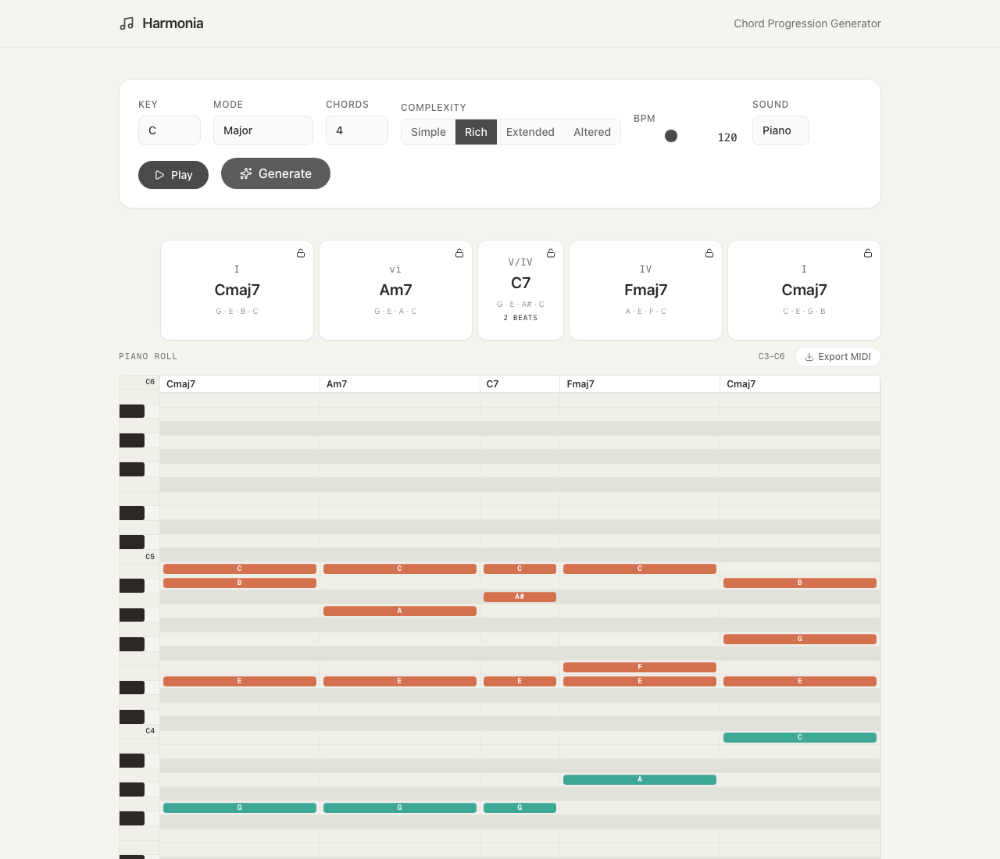

# Harmonia — Chord Progression Generator & Harmonic Sketchpad

Generate musically coherent chord progressions in any key and mode. Plan the harmonic structure of entire songs with the Harmonic Sketchpad. Hear everything instantly with real piano samples, edit individual notes, and export to MIDI.



## Features

### Chord Progression Generator

- **5 modes** — Major, Minor, Dorian, Mixolydian, Phrygian
- **4 complexity levels** — Simple triads through altered dominants, tritone substitutions, and passing chords
- **Variable-duration chords** — Full, half, quarter, and eighth-note durations assigned contextually
- **Real piano samples** — Salamander Grand Piano via Tone.js, plus Mellow, Bell, and Bright synth presets
- **Interactive piano roll** — Click notes to preview, select and shift individual notes up/down by octave
- **Chord locking** — Lock specific chords to preserve them while regenerating the rest
- **MIDI export** — Download your progression as a standard MIDI file
- **Adjustable BPM** — 60–180 BPM with looping playback

### Harmonic Sketchpad

A song-level harmonic planning workspace for sketching the harmonic architecture of a full song before opening a DAW.

- **Multi-section song structure** — Add Intro, Verse, Pre-Chorus, Chorus, Bridge, Drop, Outro, or custom sections
- **Variant system** — Create multiple progression alternatives per section and switch between them
- **Diatonic chord palette** — One-click insertion of diatonic chords for the current key and scale
- **Custom chord input** — Type any chord symbol (e.g. Am7, F#dim, Gsus4) to add it to a progression
- **Per-section key and scale** — Override the global key for individual sections (useful for modulations)
- **Section reordering** — Drag sections up and down to rearrange song flow
- **Playback modes** — Play a single chord, a section, loop a section, play the full song, or preview transitions between adjacent sections
- **Piano roll visualization** — See chord voicings and note placement for the active progression
- **Roman numeral analysis** — Chords are labeled with Roman numerals relative to the section key
- **Theory context panel** — View chord tones, key, and scale information while working
- **Song flow overview** — See all sections at a glance with chord counts
- **Local persistence** — Sketches are saved to localStorage and persist across sessions

## Getting Started

```bash
npm install
npm run dev
```

Open [http://localhost:3000](http://localhost:3000) to start generating progressions, or navigate to [http://localhost:3000/sketchpad](http://localhost:3000/sketchpad) to open the Harmonic Sketchpad.

## Tech Stack

- [Next.js 14](https://nextjs.org) — React framework
- [Tone.js](https://tonejs.github.io) — Web audio synthesis and scheduling
- [Zustand](https://zustand.docs.pmnd.rs) — State management
- [Tailwind CSS](https://tailwindcss.com) — Utility-first styling
- [Framer Motion](https://motion.dev) — Animations
- TypeScript

## Usage

### Chord Progression Generator

1. Pick a **key** and **mode** from the control panel
2. Set **complexity** (Simple → Altered) and number of chords
3. Click **Generate** to create a progression
4. Click any chord card to preview it, or hit **Play** to loop the full progression
5. Use the piano roll to inspect voicings — click a note then **Cmd/Ctrl + Arrow Up/Down** to shift it by octave
6. **Lock** chords you like, then regenerate to replace only the unlocked ones
7. **Export MIDI** to bring your progression into a DAW

### Harmonic Sketchpad

1. Click **Sketchpad** in the header to open the workspace
2. Create a new sketch with a title, key, and scale
3. **Add sections** (Verse, Chorus, Bridge, etc.) from the left panel
4. Select a section to open the editor — click diatonic chords or type custom chords to build a progression
5. Create **alternate variants** (A, B, C) for a section to compare different harmonic ideas
6. **Reorder sections** using the up/down arrows to shape the song flow
7. Use the playback controls to audition a section, loop it, play the full song, or preview transitions
8. The right panel shows a piano roll, Roman numeral analysis, and song flow overview

## Roadmap

### v2 — Learning Path

Harmonia originally began as a music theory learning platform. The learning path features — including flashcards, spaced repetition, circle of fifths exercises, and milestone-based theory curriculum — have been archived and are planned for a v2 release. The foundation for these features (database schema, card templates, SRS engine) remains in the codebase under `_deferred/` and will be reintroduced in a future version.
